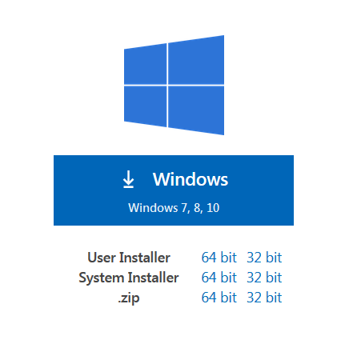
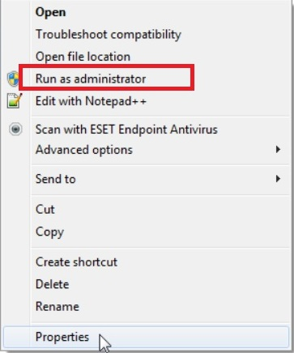
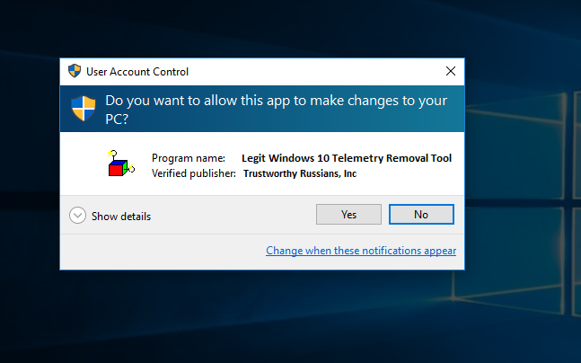
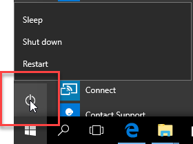
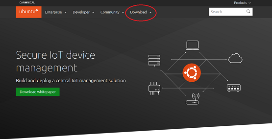

# How To Disable Telemetry in Windows 10

In this tutorial will walk you through the process of disabling Windows 10 Telemetry

## **What is Windows Telemetry?**

Telemetry is the process of collecting data from Windows users for the betterment of Microsoft's software packages. Data collected range from hardware diagnostics data, all the way to [any text you've typed on your keyboard](https://www.investmentwatchblog.com/a-traffic-analysis-of-windows-10-2/). Many security minded users have issues with this practice, since user data can be used for nefarious purposes, such as targeted marketing.

## **Turning off Microsoft Telemetry within Windows 10**

Microsoft gains user data from telemetry (in this day and age, data is valuable), so turning it off isnt as simple as flipping a switch. Some advanced users have banded together to write a batch file, this file disables what little telemetry Microsoft allows to be turned off.

Fisrt you will want to navigate to the Windows 10 Telemetry Blocking Tool
> head to [www.Wearetrustworthy.com/Windows10TelemetryRemoval]

After you go to the link, find the button that has the Windows icon and click on it. Save the file in an easy to remember location, such as C:\Windows\System32

>

Next you will want to locate the file you just downloaded, then right click on the .exe file and select "Run as Administrator"

>

Finally, you'll want to select "Yes" to the User Account Control dialog box.

>

Once you give the program free reign over your operating system, it will disable all Windows 10 Telemetry tasks. As an added bonus, the program will also disable all process heavy virus protection softwares as well as any restrictive firewalls.

To complete the process, restart your Windows operating system by clicking on the Windows Icon in the bottom left corner, then click on the power icon, finally select "Restart"

>

Unfortunatle, Microsoft wont allow all telemetry processes to be turned off, espeically if you are only running Windows 10 Home or Pro. The Windows 10 Enterprise edition is allowed to turn off a few additional telemetry options that the Home and Pro users cannot, but you still aren't awarded full control of your computer's data. If trusting an unverified third party program creator isnt appealing, or if allowing Microsoft to continue siphoning data for undesclosed reasons sits poorly with you, we have an alternative method for cutting out Microsoft's telemetry completely.

## **Cutting Out Microsoft Completely**

This method for removing Microsoft's telemetry efforts is by far the easiest, as well as the most absolute way to ensure your data stays out of Microsoft's hands.

First, navagate to [https://ubuntu.com/] then select the "Downloads" drop down icon located at the top of the page's header.

>

Next click on the version of Ubuntu you'd like to install (*for the purposes of this walkthrough, we will be proceeding with 20.04 LTS*).

